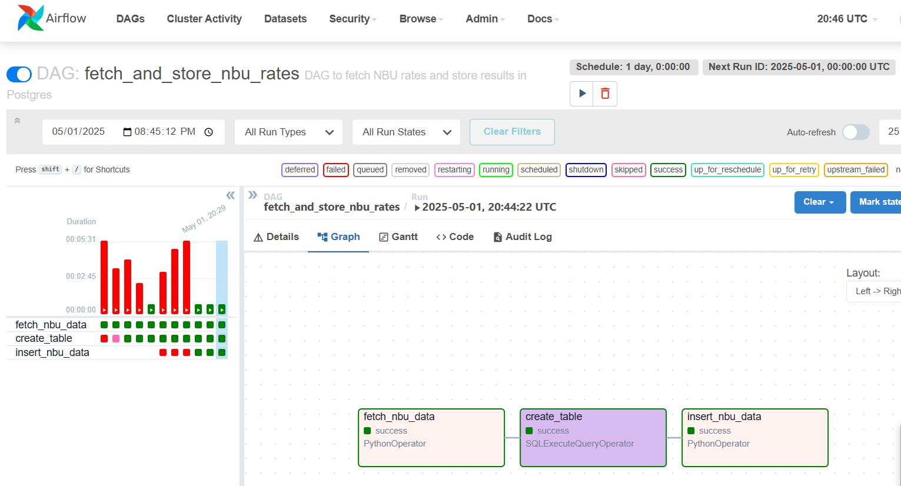
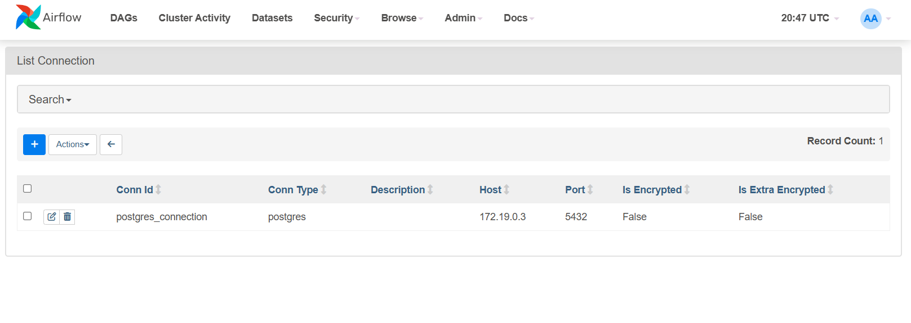
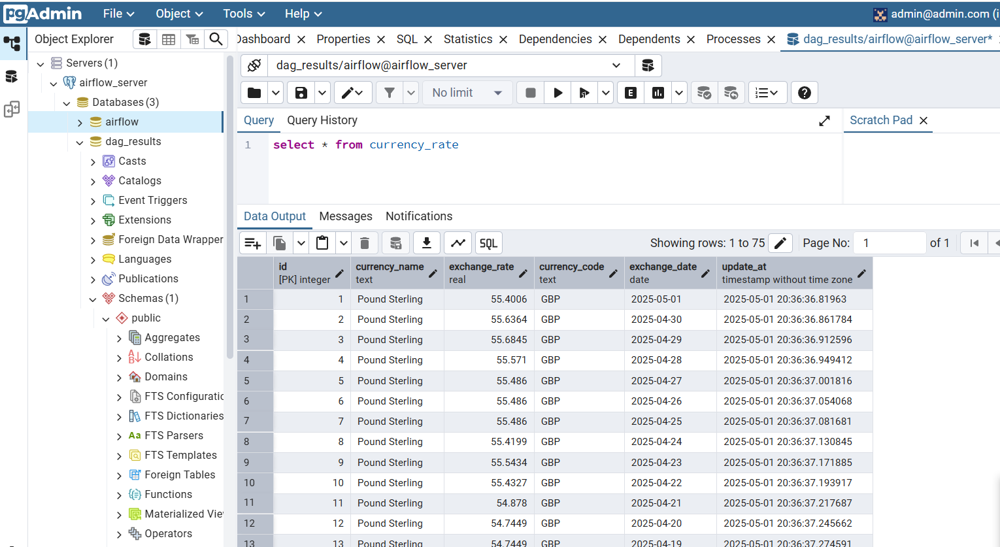

### This repo contains Airflow DAG setup

Steps followed to [setup this project](https://airflow.apache.org/docs/apache-airflow/stable/howto/docker-compose/index.html) but updated for Windows
1. Get Docker-compose file for Airflow `curl.exe -LfO 'https://airflow.apache.org/docs/apache-airflow/2.9.1/docker-compose.yaml'` 
2. Create folders `mkdir dags, logs, plugins, config`
3. Add .env file with `AIRFLOW_UID=50000`
4. Run docker compose to initialize db `docker compose up airflow-init`
5. Optional - If running on Windows and getting error like `At least 4GB of memory required. You have 3.4G `.
Need to do create WSL (Windows Sybsystem for Linux) config at `C:\Users\User\.wslconfig` with content `[wsl2] memory=8GB` 
as per [airflow before you begin](https://airflow.apache.org/docs/apache-airflow/stable/howto/docker-compose/index.html#before-you-begin)
and [wsl documentation](https://learn.microsoft.com/en-us/windows/wsl/wsl-config#configure-global-options-with-wslconfig)
and restart PC. To see if config was applied, run `wsl` -> `free -h` to see how much memory is allocated.
6. Start all services `docker compose up`
7. Login to http://localhost:8080/ (airflow/airflow) and pgadmin (admin@admin.com/root)
8. Create server in pgadmin - `Add new server` -> General: enter name like `airflow_server` -> Connection: enter username & password (airflow/airflow) 
& Host name/address (`docker container ls` -> `docker inspect <postgres_id>` -> get IPAddress under Networks)
9. Create new db like `dag_results`
10. Go to Airflow -> Connections -> create postgres connection with host/port/db_name/user/password from above
11. Setup DAG
12. Run DAG on UI and check db for results

DAG run results:

Postgres connection:

Postgres results

3xyoM28B40Y